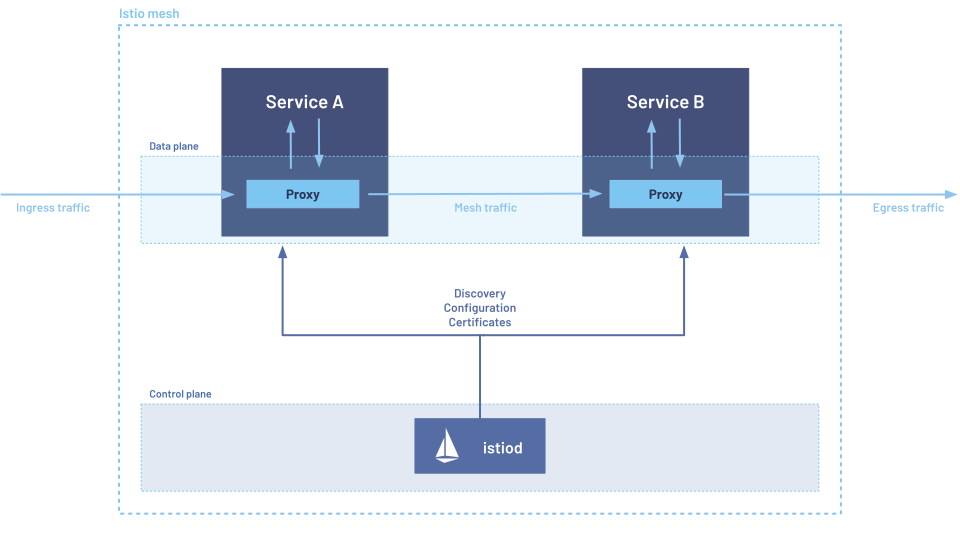

## Istio Architecture



## BookInfo Application


## Enable Sidecar

```sh
kubectl label namespace default istio-injection=enabled
```

## Deploy Your Application

```sh
kubectl apply -f example/bookinfo.yaml
```

## Create an Istio Gateway

```sh
kubectl apply -f example/bookinfo-gateway.yaml
```

## Routing

### Route to Version 1

```sh
kubectl apply -f example/virtual-service-all-v1.yaml
```

### Route Based on User Identity

```sh
kubectl apply -f example/virtual-service-reviews-test-v2.yaml
```

### Cleanup

```sh
kubectl delete -f example/virtual-service-all-v1.yaml
```

## Fault Injection

```sh
kubectl apply -f example/virtual-service-all-v1.yaml
kubectl apply -f example/virtual-service-reviews-test-v2.yaml
```

### Injecting an HTTP Delay Fault

```sh
kubectl apply -f example/virtual-service-ratings-test-delay.yaml
```

### Injecting an HTTP Abort Fault

```sh
kubectl apply -f example/virtual-service-ratings-test-abort.yaml
```

### Cleanup

```sh
kubectl delete -f example/virtual-service-all-v1.yaml
```

## Traffic Shifting

### Initial Setup

```sh
kubectl apply -f example/virtual-service-all-v1.yaml
```

### Transfer 50% Traffic from reviews:v1 to reviews:v3

```sh
kubectl apply -f example/virtual-service-reviews-50-v3.yaml
```

### Route 100% of Traffic to reviews:v3

```sh
kubectl apply -f example/virtual-service-reviews-v3.yaml
```

### Cleanup

```sh
kubectl delete -f example/virtual-service-all-v1.yaml
```

## Configure Access Control for Workloads using HTTP Traffic

### Deny All Traffic

```sh
kubectl apply -f - <<EOF
apiVersion: security.istio.io/v1
kind: AuthorizationPolicy
metadata:
  name: allow-nothing
  namespace: default
spec:
  {}
EOF
```

### Allow Access to Product Page

```sh
kubectl apply -f - <<EOF
apiVersion: security.istio.io/v1
kind: AuthorizationPolicy
metadata:
  name: "productpage-viewer"
  namespace: default
spec:
  selector:
    matchLabels:
      app: productpage
  action: ALLOW
  rules:
  - to:
    - operation:
        methods: ["GET"]
EOF
```

### Allow Access to Details Workload

```sh
kubectl apply -f - <<EOF
apiVersion: security.istio.io/v1
kind: AuthorizationPolicy
metadata:
  name: "details-viewer"
  namespace: default
spec:
  selector:
    matchLabels:
      app: details
  action: ALLOW
  rules:
  - from:
    - source:
        principals: ["cluster.local/ns/default/sa/bookinfo-productpage"]
    to:
    - operation:
        methods: ["GET"]
EOF
```

### Allow Access to Reviews Workload

```sh
kubectl apply -f - <<EOF
apiVersion: security.istio.io/v1
kind: AuthorizationPolicy
metadata:
  name: "reviews-viewer"
  namespace: default
spec:
  selector:
    matchLabels:
      app: reviews
  action: ALLOW
  rules:
  - from:
    - source:
        principals: ["cluster.local/ns/default/sa/bookinfo-productpage"]
    to:
    - operation:
        methods: ["GET"]
EOF
```

### Allow Access to Ratings Workload

```sh
kubectl apply -f - <<EOF
apiVersion: security.istio.io/v1
kind: AuthorizationPolicy
metadata:
  name: "ratings-viewer"
  namespace: default
spec:
  selector:
    matchLabels:
      app: ratings
  action: ALLOW
  rules:
  - from:
    - source:
        principals: ["cluster.local/ns/default/sa/bookinfo-reviews"]
    to:
    - operation:
        methods: ["GET"]
EOF
```

## Cleanup

```sh
kubectl delete authorizationpolicy.security.istio.io/allow-nothing
kubectl delete authorizationpolicy.security.istio.io/productpage-viewer
kubectl delete authorizationpolicy.security.istio.io/details-viewer
kubectl delete authorizationpolicy.security.istio.io/reviews-viewer
kubectl delete authorizationpolicy.security.istio.io/ratings-viewer
```

```sh
sh example/cleanup.sh
```

Reference link

- https://istio.io/latest/docs/tasks/


